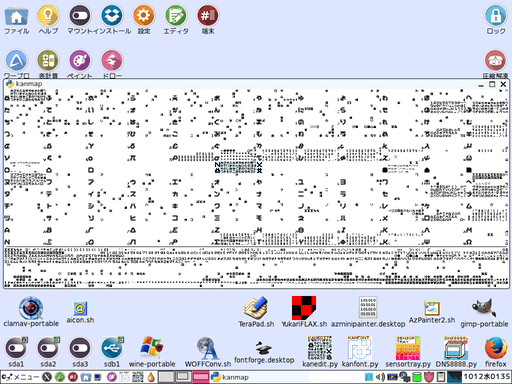

# 「LTsv10kanedit(tsvtool10)」は「L:Tsv」の読み書きを中心としたモジュール群と漢字エディタ「kanedit」のPythonによる実装です。

前作「[LTsv9kantray](https://github.com/ooblog/LTsv9kantray "LTsv9kantray")」のキーフック方式の代わりに漢直キーボードを各アプリに搭載する作戦が「LTsv10kanedit」のコンセプトです。  

## 「kanedit」は漢直エディタです&#40;開発中&#41;。NFER,XFERキーによる鍵盤切替＆KANAキーによる字引入力で漢字を直接入力します。

  
※エディタ「kanedit」は現在１行テキストの「電卓」だけ動いてます。テキストファイルの編集などはまだ実装してません。  

「kanedit」の詳細は「[kanedit.txt](kanedit.txt "kanedit.txt")」を参考。  

## 「kanfont」は単漢字辞書「kanchar.tsv」を編集するソフトです。辞書の項目にはフォント「kan5x5cmic」のグリフデザインも含まれます。

  
「[LTsv/kanchar.tsv](LTsv/kanchar.tsv "LTsv/kanchar.tsv")」から「kan5x5.svg」を生成して、「[FontForge](http://fontforge.github.io/ja/ "FontForge")」で変換してもらう事でフォント「kan5x5comic.ttf」が作成できます。
FontForgeの導入が困難なWindowsの場合、「kan5x5comic.woff&#40;準備中&#41;」を「[WOFFコンバータ](http://opentype.jp/woffconv.htm "WOFFコンバータ")」でTTFに変換してください。  

「kanedit」の詳細は「[kanfont.txt](kanfont.txt "kanfont.txt")」を参考。  

## 「kanzip」は郵便番号辞書「kanzip.tsv」を作成するソフトです。

  
「[〒郵便番号](http://www.post.japanpost.jp/zipcode/dl/readme.html "郵便番号データの説明 - 日本郵便")」からzipをダウンロードして郵便番号辞書「kanzip.tsv」を作成します。  
郵便番号辞書あ「kanedit」の「電卓」で使用できます。  

「kanzip」の詳細は「[kanzip.txt](kanzip.txt "kanzip.txt")」を参考。  

## 「kanmap」は漢字配列「kanmap.tsv」を編集する…事はまだできませんがパイクル「kanpickle.bin」に「kan5x5comic」を積み込む事ができます。

  
「[LTsv/kanmap.tsv](LTsv/kanmap.tsv "LTsv/kanmap.tsv")」から「kanpickle.bin」と「kanmap.png」を生成します&#40;PNGの生成はGTKのみ&#41;。  
不足しているグリフを「kanfont」で「[LTsv/kanchar.tsv](LTsv/kanchar.tsv "LTsv/kanchar.tsv")」に追加していく流れです。  
「kan5x5comic」グリフ作成の進捗状況が確認できます。  

「kanmap」の詳細は「[kanmap.txt](kanmap.txt "kanmap.txt")」を参考。  

## 「L&#58;Tsv」は上記のようなソフトも作れるモジュール群です。

「L&#58;Tsv」の詳細は「[LTsv/LTsv.txt](LTsv/LTsv.txt "LTsv.txt")」を参考。  
ドキュメントは整理中につき「kantray」の話題が混在しています。  

## 動作環境。

Python 2.7.6&#40;Tahrpup6.0.5&#41;およびPython3.4.4&#40;Wine1.7.18&#41;で動作を確認しています。  

## ライセンス・著作権など。

Copyright (c) 2016 ooblog  
License: MIT  
[https://github.com/ooblog/LTsv10kanedit/blob/master/LICENSE](https://github.com/ooblog/LTsv10kanedit/blob/master/LICENSE "https://github.com/ooblog/LTsv10kanedit/blob/master/LICENSE")  
