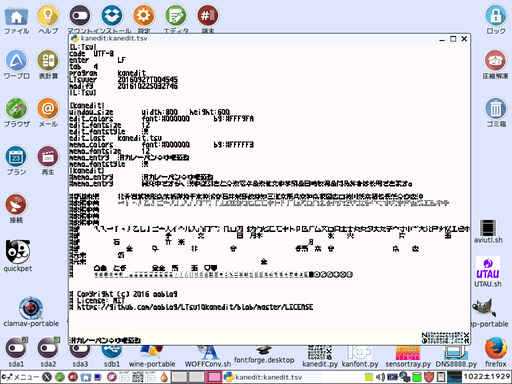
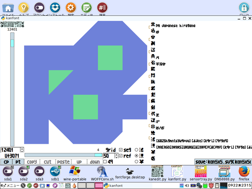
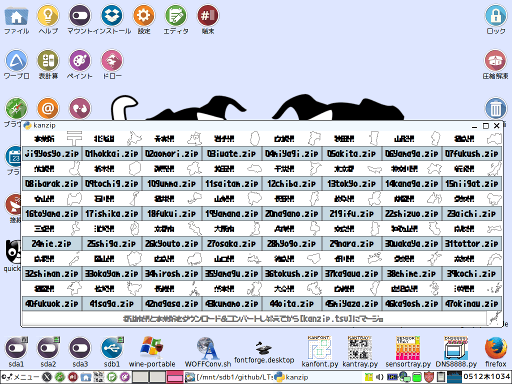

# 「LTsv9kantray(tsvtool9)」は「L:Tsv」の読み書きを中心としたモジュール群と漢字入力「kantray」のPythonによる実装でした。

## 「kantray」→「kanedit」に移行計画。

  
「kantray」のキー入力割り込み方式の漢直だとの部分でOSによっては動かないもしくは意図しない動きになる危険性があるので、  
漢直専用エディタ「kanedit」の開発をしています。  
ある程度「kanedit」でテキスト編集ができるレベルになったら「LTsv10kantray(tsvtool10)」リポジトリに移動する予定です。

## 「kantray」は日本語入力ソフトの予定でした。漢字を直接入力する(変換サジェストが存在しない)ので漢直のジャンルです。

  
通知タスクトレイ&#40;Notify&#41;に鍵盤アイコンを表示するので、漢字配列を丸暗記しなくても使えます。  
※「[鍵盤アイコン(kanmap.png)](kanmap.png "https://github.com/ooblog/LTsv9kantray/blob/master/kanmap.png")」には描画途中の箇所があります。  
※アイコン描画されてない&#40;α鍵盤&#41;にも未整頓ではありますが「[漢字配列(kanmap.tsv)](kanmap.tsv "https://github.com/ooblog/LTsv9kantray/blob/master/kanmap.tsv")」上に漢字があります。  
※配列に無い漢字も「[単漢字辞書(kanchar.tsv)](kanchar.tsv "https://github.com/ooblog/LTsv9kantray/blob/master/kanchar.tsv")」からの字引入力で異体字なども漢直できます。  

### 「kantray」が想定してた操作方法

Tkinter環境&#40;Windows&#41;ならマウス操作「貼付モード」のみですが、  
GTK2の通知タスクトレイ&#40;Notify&#41;が使える環境ならキーボード操作「漢直モード」も使用可能になります。  
親指で&#91;NFER&#40;無変換&#41;&#93;,&#91;XFER&#40;変換&#41;&#93;,&#91;Space&#40;SandS&#41;&#93;,&#91;KANA&#93;キーを操作して鍵盤を交換しながら漢字を直接入力します。  
漢直の実装はキーフック(EVIOCGRAB)でキーボード操作を吸収してクリップボード経由で文字入力するので、  
&#91;Ctrl&#93;+&#91;V&#93;で貼り付けができないエディタでは漢直できません。逆にVim以外のエディタでもhjkl移動を可能にします。  
※「PuppyLinux571JP」と同じ方法が「Tahrpup6.0.5」で使えなかったのでキーボード入力は一旦保留にしました。  

漢直の操作方法は「[kantray.txt](kantray.txt "https://github.com/ooblog/LTsv9kantray/blob/master/kantray.txt")」の方に書いてます。  
電卓フォーマットや日時フォーマットなどの仕様は「[LTsv.txt](LTsv.txt "https://github.com/ooblog/LTsv9kantray/blob/master/LTsv.txt")」の方に書いてます。  

## 「kanfont」は単漢字辞書&#91;kanchar.tsv&#93;の管理するソフトです。辞書の項目にはフォントのグリフデザインも含まれます。

  
「kanfont.svg」を「kantray5x5comic.ttf」に変換するには「[FontForge](http://fontforge.github.io/ja/ "FontForge")」が別途必要です。  
FontForgeの導入が困難なWindowsの場合、「kantray5x5comic.woff」を「[WOFFコンバータ](http://opentype.jp/woffconv.htm "WOFFコンバータ")」でTTFに変換してください。  

### グリフキャンバスの座標とSVGパスの座標の違い。

グリフキャンバスのサイズは512ですがフォントの想定サイズは1024です。  
グリフキャンバスは左上が&#40;0,0&#41;ですがフォントは左下が&#40;0,0&#41;です。  
「活」の項目には上下と縮尺二倍を修正したSVGパスが入ります。  
「kanfont」は直線しか編集できない&#40;ポリゴン限定「M」と「z」しか対応してない&#41;ので注意。  

## 「kanzip」は郵便番号辞書&#91;kanzip.tsv&#93;を作成するソフトです。

  
「[〒郵便番号](http://www.post.japanpost.jp/zipcode/dl/readme.html "郵便番号データの説明 - 日本郵便")」からzipをダウンロードして郵便番号辞書「kanzip.tsv」を作成します。  

## 「LTsv」はアプリを作るためのモジュール群です。

モジュールの仕様や「kantray」の電卓で使う日時フォーマット・電卓フォーマットの仕様とかは[LTsv.txt](LTsv.txt)の方に書いてます。  

## 動作環境。

Python 2.7.6&#40;Tahrpup6.0.5)およびPython3.4.4&#40;Wine1.7.18&#41;で動作を確認しています。  
Python2.7.3&#40;PuppyLinux571JP)およびPython3.4.3&#40;Wine1.7.18&#41;でも多分動くかと思います&#40;旧開発環境&#41;。  
Linux同士でも「/dev/input/event」のキーボードデバイス番号が変わるので「[LTsv.txt](LTsv.txt "https://github.com/ooblog/LTsv9kantray/blob/master/LTsv.txt")」を参照。  

## ライセンス・著作権など。

Copyright (c) 2016 ooblog  
License: MIT  
[https://github.com/ooblog/LTsv9kantray/blob/master/LICENSE](https://github.com/ooblog/LTsv9kantray/blob/master/LICENSE "https://github.com/ooblog/LTsv9kantray/blob/master/LICENSE")  
