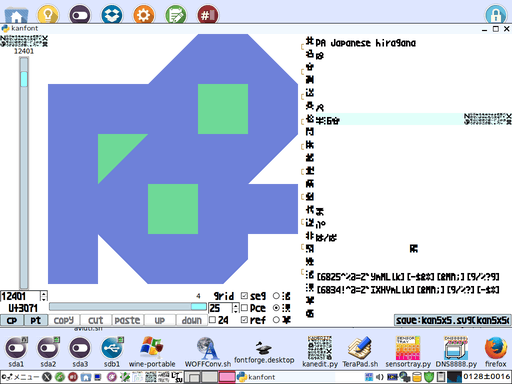

# 「LTsv10kanedit(tsvtool10)」は「L:Tsv」の読み書きを中心としたモジュール群と漢字エディタ「kanedit」のPythonによる実装の予定です。

html版ドキュメント整備中。「[https://github.com/ooblog/LTsv10kanedit/](https://github.com/ooblog/LTsv10kanedit/ "「LTsv10kanedit(tsvtool10)」は「L:Tsv」の読み書きを中心としたモジュール群です。")」

## 「kanedit」は「LTsv10kanedit&#40;tsvtool10&#41;」を用いた漢直テキストエディタの予定です。

  
NFER,XFERキーによる鍵盤切替＆KANAキーによる字引入力で漢字を直接入力します。  
※エディタ「kanedit」は現在１行テキストの「電卓」だけ動いてます&#40;開発中&#41;。テキストファイルの編集などはまだ実装してません。  

「kanedit」の詳細は「[docs/kanedit.txt](https://github.com/ooblog/LTsv10kanedit/blob/master/docs/kanedit.txt "「kanedit」は「LTsv10kanedit(tsvtool10)」を用いた漢直テキストエディタの予定です。")&#40;[docs/kanedit.txt](https://ooblog.github.io/LTsv10kanedit/kanedit.html "「kanedit」は「LTsv10kanedit(tsvtool10)」を用いた漢直テキストエディタの予定です。")&#41;」を参考。  

## 「kanfont」は「LTsv10kanedit&#40;tsvtool10&#41;」を用いたフォントエディタ(グリフエディタ)です。

  
「[LTsv/kanchar.tsv](LTsv/kanchar.tsv "LTsv/kanchar.tsv")」から「kan5x5.svg」を生成して「[FontForge](http://fontforge.github.io/ja/ "FontForge")」などで変換してフォント「kan5x5comic.ttf」も作成できますが、  
「kanedit」は「[LTsv/kanchar.tsv](LTsv/kanchar.tsv "LTsv/kanchar.tsv")」を直に読み込む事でグリフを描画します。これにより「Tkinter」で表示できないCP932&#40;いわゆるシフトJIS、BMP基本多言語面0xffff範囲&#41;外の文字を扱えます。  

「kanfont」の詳細は「[docs/kanfont.txt](https://github.com/ooblog/LTsv10kanedit/blob/master/docs/kanfont.txt "「kanfont」は「LTsv10kanedit(tsvtool10)」を用いたフォントエディタ(グリフエディタ)です。")&#40;[docs/kanfont.txt](https://ooblog.github.io/LTsv10kanedit/kanfont.html "「kanfont」は「LTsv10kanedit(tsvtool10)」を用いたフォントエディタ(グリフエディタ)です。")&#41;」を参考。  

## 「kanzip」は「LTsv10kanedit&#40;tsvtool10&#41;」を用いた郵便番号ダウンローダーです。

  
「[〒郵便番号](http://www.post.japanpost.jp/zipcode/dl/readme.html "郵便番号データの説明 - 日本郵便")」からzipをダウンロードして郵便番号辞書「kanzip.tsv」を作成します。  

「kanzip」の詳細は「[docs/kanzip.txt](https://github.com/ooblog/LTsv10kanedit/blob/master/docs/kanzip.txt "「kanzip」は「LTsv10kanedit(tsvtool10)」を用いた郵便番号ダウンローダーです。")&#40;[docs/kanzip.txt](https://ooblog.github.io/LTsv10kanedit/kanzip.html "「kanzip」は「LTsv10kanedit(tsvtool10)」を用いた郵便番号ダウンローダーです。")&#41;」を参考。  

## 「kanmap」は「LTsv10kanedit&#40;tsvtool10&#41;」を用いたグリフ進捗ビュアーです。

  
「kan5x5comic」グリフ作成の進捗状況が確認できます。編集機能は準備中です。  

「kanmap」の詳細は「[docs/kanmap.txt](https://github.com/ooblog/LTsv10kanedit/blob/master/docs/kanmap.txt "「kanmap」は「LTsv10kanedit(tsvtool10)」を用いたグリフ進捗ビュアーです。")&#40;[docs/kanmap.txt](https://ooblog.github.io/LTsv10kanedit/kanmap.html "「kanmap」は「LTsv10kanedit(tsvtool10)」を用いたグリフ進捗ビュアーです。")&#41;」を参考。  

## 「LTsv_doc」は「LTsv10kanedit&#40;tsvtool10&#41;」を用いたドキュメントジェネレーターです。

  
モジュール解説文書「[docs/LTsv10.txt](https://github.com/ooblog/LTsv10kanedit/blob/master/docs/LTsv10.txt "「<？LTsv>」は「L:Tsv」の読み書きを中心としたモジュール群です。")&#40;[docs/LTsv10.txt](https://ooblog.github.io/LTsv10kanedit/index.html "「<？LTsv>」は「L:Tsv」の読み書きを中心としたモジュール群です。")&#41;」等は「[LTsv/LTsv_doc.py](docs/kanedit_etc.tsv "docs/kanedit_etc.tsv")」を使って「[docs/kanedit_etc.tsv](https://github.com/ooblog/LTsv10kanedit/blob/master/LICENSE "https://github.com/ooblog/LTsv10kanedit/blob/master/LICENSE")」から生成されてます。  

「LTsv_doc」の詳細は「[docs/LTsv_doc.txt](https://github.com/ooblog/LTsv10kanedit/blob/master/docs/LTsv_doc.txt "「LTsv_doc」は「LTsv10kanedit(tsvtool10)」を用いたドキュメントジェネレーターです。")&#40;[docs/LTsv_doc.txt](https://ooblog.github.io/LTsv10kanedit/LTsv_doc.html "「LTsv_doc」は「LTsv10kanedit(tsvtool10)」を用いたドキュメントジェネレーターです。")&#41;」を参考。  

## 動作環境。

Python 2.7.6&#40;Tahrpup6.0.5&#41;およびPython3.4.4&#40;Wine1.7.18&#41;で動作を確認しています。  

## ライセンス・著作権など。

Copyright (c) 2016 ooblog  
License: MIT  
[https://github.com/ooblog/LTsv10kanedit/blob/master/LICENSE](LICENSE "<＄txt/htmldoc-4>")  

